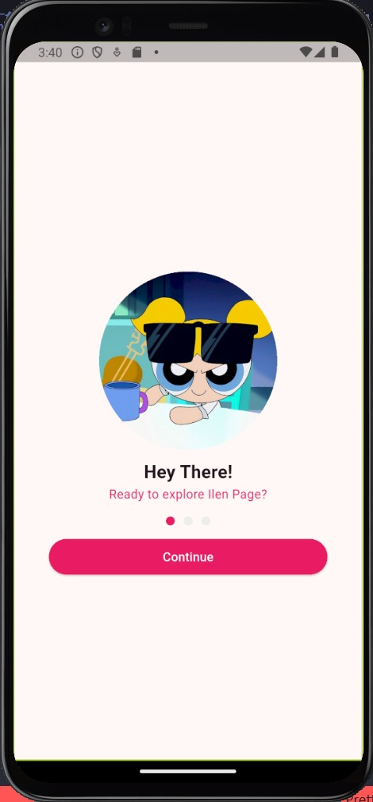
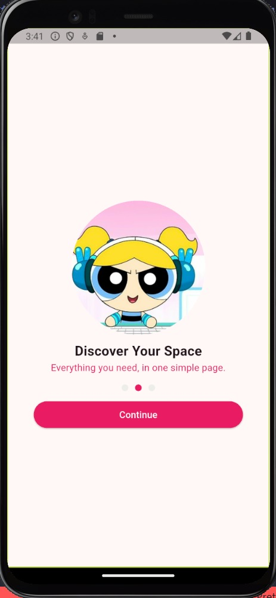
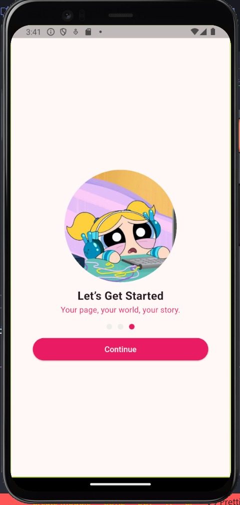
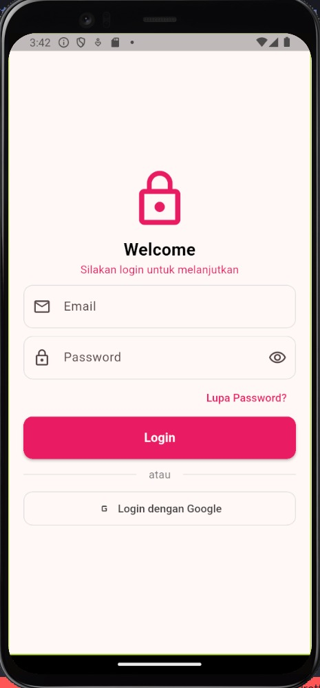

# 📱 UTS Aplikasi Mobile – Splash Screen & Login Page

**Nama Lengkap:** Helen Oktaviani  
**NIM:** 1123150205  
**Kelas / Prodi:** Teknik Informatika – Konsentrasi Software Engineering

---

## 📸 Hasil Screenshot

### Splash Screen 1


### Splash Screen 2


### Splash Screen 3


### Login Page


---

## 🚀 Cara Menjalankan Project di Device (Android Emulator)

1. Pastikan Flutter sudah terinstall dan environment sudah siap:
   ```bash
   flutter doctor
2. Jalankan emulator (misal Pixel 4):
   flutter emulators --launch Pixel_4
3. Jalankan aplikasi ke emulator:
   flutter run

⚙️ Catatan Kendala
🧩 Beberapa kendala yang dialami selama pengembangan:
-Emulator sempat tidak menampilkan tampilan (layar hitam)
-Error import package (Target of URI doesn’t exist)
-Perlu menjalankan ulang flutter clean dan flutter pub get agar aset muncul